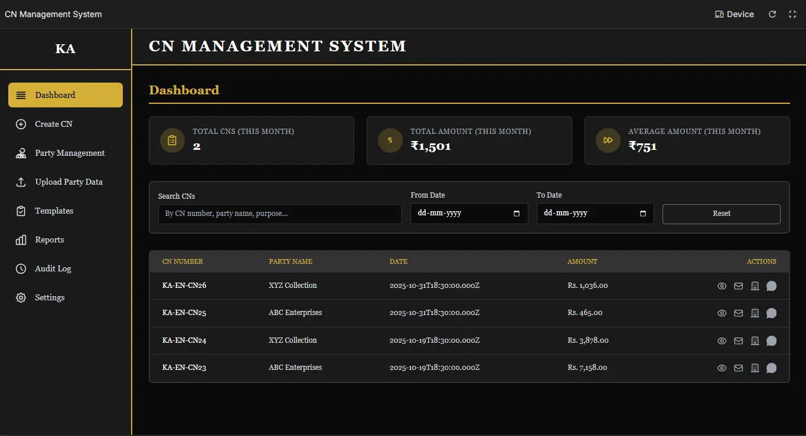
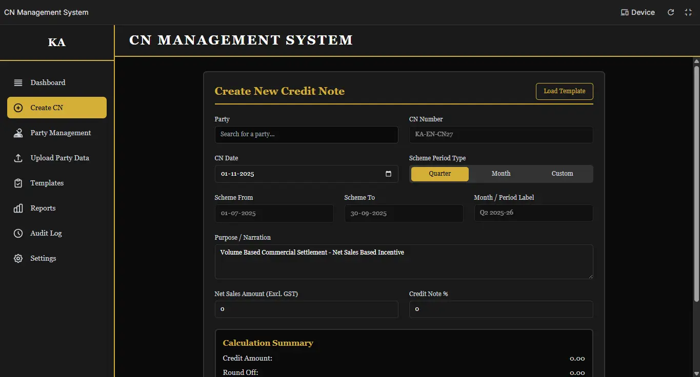
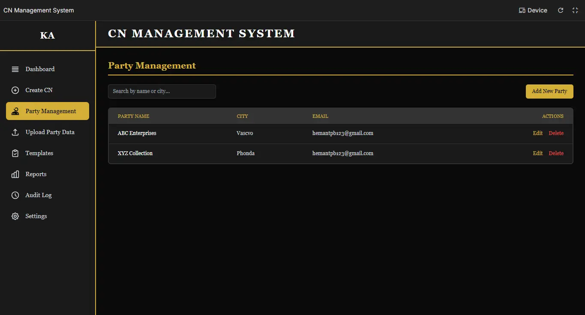
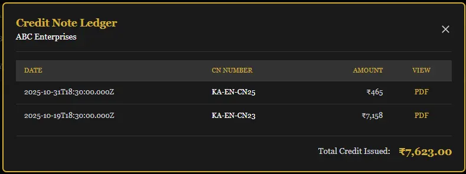
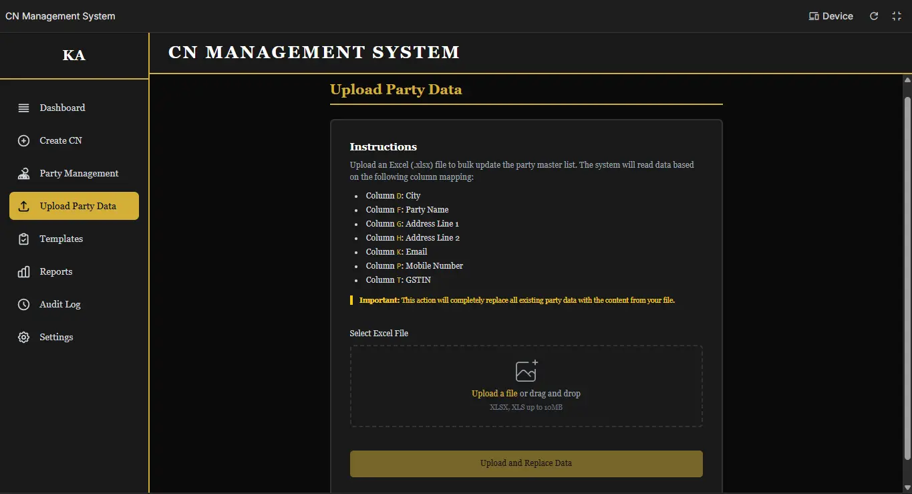

# 💼 CN Management System  
*A Progressive Web App (PWA) for Automated Credit Note Management*  

---

### 🌐 Live Demo  
[🔗 View Project Overview (HTML)](./portfolio.html)  

---

### 📘 Overview  

The **CN Management System** is a modern, cloud-native **Progressive Web App (PWA)** designed to automate and simplify credit note (CN) generation and distribution workflows.  
It seamlessly integrates with **Google Workspace tools** — including Google Sheets, Drive, and Gmail — to automate PDF creation, email dispatch, and ledger tracking.  

This app was built within **2 days using AI assistance**, designed and tested for a real business use case, and deployed successfully for day-to-day CN management operations.

---

### 🧭 Sidebar Navigation  

The app features a clean, responsive sidebar with quick access to all modules:

- 📊 **Dashboard**  
- 🧾 **Create CN**  
- 👥 **Party Management**  
- 📤 **Upload Party Data**  
- 🧩 **Templates**  
- 📈 **Reports & Analytics**  
- 🕓 **Audit Log**  
- ⚙️ **Settings**  

---

### 📊 Dashboard  

Displays key performance indicators (KPIs) and recent CN activity:

| KPI | Description |
|-----|--------------|
| **Total CNs (This Month)** | Total credit notes issued this month |
| **Total Amount (This Month)** | Sum of all credit note amounts |
| **Average Amount (This Month)** | Average CN amount for the period |

Includes:
- 🔍 **Search CN** by number, party name, or purpose  
- 📅 **Filter by Date Range**  
- 📋 **10 Most Recent CNs** displayed for quick access  

📸 **Screenshot:**  

---

### 🧾 Create CN  

A guided form for generating new credit notes efficiently.

**Form Fields:**
- **Party:** Searchable from Firebase  
- **CN Number:** Auto-generated  
- **CN Date:** Current date (auto-filled)  
- **Scheme Period Type:**  
  - Quarter (auto previous quarter)  
  - Month (auto previous month)  
  - Custom (user defined)  
- **Scheme From / To Dates**  
- **Purpose / Narration**  
- **Net Sales Amount (Excl. GST)**  
- **Credit Note %** (auto calculates credit, round-off, and final amount)  

**Actions:**  
- Save as Template  
- Preview CN (Modal Preview)  
- Generate & Send CN (Triggers automation workflow)

📸 **Screenshot:**  

---

### 👥 Party Management  

Manage parties easily with full CRUD functionality.

- 🔍 **Search** by party name or city  
- ➕ **Add / Edit / Delete** party records  
- 📋 Clicking a party name opens a modal showing all CNs issued to that party  

📸 **Screenshot: (Party Management)**  

📸 **Screenshot: (Party CN ledger)**

---

### 📤 Upload Party Data  

Bulk import parties directly from your ERP system.  
- Accepts `.xlsx` files in a standard format  
- Data is synced with **Firebase Realtime Database**  
- Uses **IndexedDB** for offline caching and instant search  

📸 **Screenshot:**  

---

### 🧩 Templates  

Save frequently used configurations for recurring CNs.  

Each template includes:  
- Template Name  
- Party  
- Narration  
- Credit Note %  

📸 **Screenshot:**  

---

### 📈 Reports & Analytics  

Comprehensive reporting for financial insights:

- **Bar Charts:**
  - Credit Amount Issued (Last 12 Months)  
  - Number of CNs Issued (Last 12 Months)
- **Top 10 Parties** by Total Credit Amount  

📸 **Screenshot:**  

---

### 🕓 Audit Log  

Track every user action for accountability and compliance.

| Timestamp | Action | Details |
|------------|---------|----------|
| 31 Oct 2025 | UPLOAD PARTIES | Uploaded and replaced 540 parties |
| 31 Oct 2025 | CREATE CN | Credit Note KA-EN-CN21 created for POSHAK RETAIL ₹5,456 |

📸 **Screenshot:**  

---

### ⚙️ Settings  

Manage company details used across all generated documents.  
All settings are pre-filled (editable), including:  
- Company Name  
- Contact Information  
- Address Lines  
- GSTIN / UDYAM / State Code  

📸 **Screenshot:**  

---

### 🧩 Tech Stack  

| Layer | Technology |
|--------|-------------|
| **Frontend** | React (TypeScript) + Tailwind CSS |
| **Backend** | Google Apps Script |
| **Database** | Firebase Realtime Database |
| **File Storage** | Google Drive |
| **Ledger** | Google Sheets |
| **Email Automation** | Gmail (MailApp Service) |
| **PDF Generator** | jsPDF + jsPDF-AutoTable |
| **Hosting** | Deployed as PWA |

---

### 🔁 Workflow Summary  

1. User fills the “Create CN” form.  
2. The app generates PDF copies (party and printer).  
3. Data and PDFs are sent to **Google Apps Script** backend.  
4. Backend:  
   - Saves PDFs to **Google Drive**  
   - Logs data in **Google Sheets**  
   - Emails CN to **Party, HO, and Printer**  
5. Confirmation & Audit Log entry are generated automatically.  

📸 **Screenshot:**  

---

### ⚙️ Setup Guide  

For detailed setup instructions, refer to:  
📄 [SETUP.md](./SETUP.md)

---

### 👨‍💻 Author  

**Hemant Borana**  
- 🎓 BCA Final Year Student  
- 📊 Aspiring Data & Business Analyst  
- 💼 Managing Brand Operations in Family Business  
- 🧠 Project ideated and built entirely in **2 days using AI assistance**  

---

### 🏁 Status  

✅ **In Production** – Currently used internally for real business CN automation.  
🧱 **Stable Build** – Fully tested and deployed.  
📱 **Cross-platform** – PWA supports desktop and mobile devices.

---

### 📜 License  

This project is proprietary to the developer.  
Code may be referenced for learning purposes but not used for commercial deployment without permission.

---
