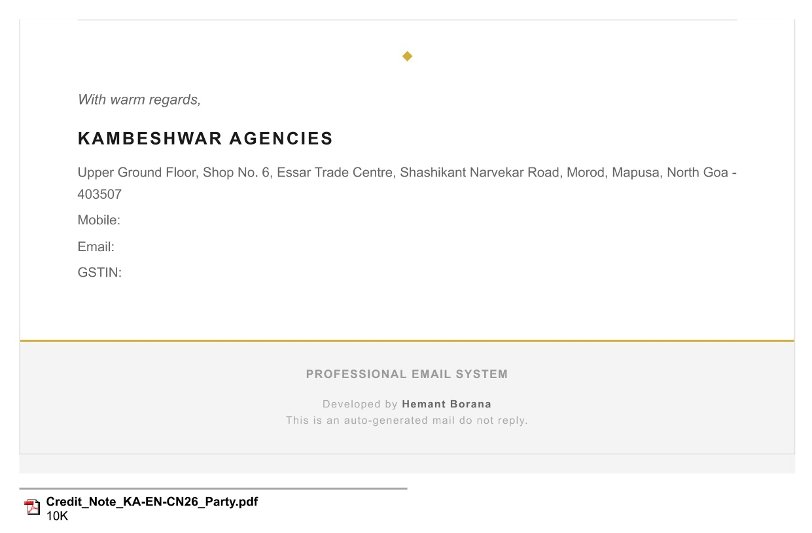

# 💼 CN Management System  
*A Progressive Web App (PWA) for Automated Credit Note Management*  

---

## 🌐 Live Demo  
[🔗 View Project Overview (HTML)](./portfolio.html)  

---

## 📘 Overview  

The **CN Management System** is a modern, cloud-native **Progressive Web App (PWA)** designed to automate and simplify credit note (CN) generation and distribution workflows.  
It seamlessly integrates with **Google Workspace tools** — including Google Sheets, Drive, and Gmail — to automate PDF creation, email dispatch, and ledger tracking.  

This app was built within **2 days using AI assistance**, designed and tested for a real business use case, and deployed successfully for day-to-day CN management operations.

---

## 🧭 Sidebar Navigation  

The app features a clean, responsive sidebar with quick access to all modules:

- 📊 **Dashboard**  
- 🧾 **Create CN**  
- 👥 **Party Management**  
- 📤 **Upload Party Data**  
- 🧩 **Templates**  
- 📈 **Reports & Analytics**  
- 🕓 **Audit Log**  
- ⚙️ **Settings**  

---

## 📊 Dashboard  

Displays key performance indicators (KPIs) and recent CN activity:

| KPI | Description |
|-----|--------------|
| **Total CNs (This Month)** | Total credit notes issued this month |
| **Total Amount (This Month)** | Sum of all credit note amounts |
| **Average Amount (This Month)** | Average CN amount for the period |

**Features:**
- 🔍 **Search CN** by number, party name, or purpose  
- 📅 **Filter by Date Range**  
- 📋 **10 Most Recent CNs** displayed for quick access  

📸 **Screenshot:**  


---

## 🧾 Create CN  

A guided form for generating new credit notes efficiently.

### Form Fields:
- **Party:** Searchable dropdown from Firebase  
- **CN Number:** Auto-generated sequential number  
- **CN Date:** Current date (auto-filled)  
- **Scheme Period Type:**  
  - Quarter (auto previous quarter)  
  - Month (auto previous month)  
  - Custom (user defined)  
- **Scheme From / To Dates**  
- **Purpose / Narration**  
- **Net Sales Amount (Excl. GST)**  
- **Credit Note %** (auto calculates credit, round-off, and final amount)  

### Actions:  
- 💾 **Save as Template** for recurring CNs  
- 👁️ **Preview CN** (Modal Preview)  
- 📤 **Generate & Send CN** (Triggers automation workflow)

📸 **Screenshots:**  


---

## 📄 Generated Credit Note Document

The system automatically generates professionally formatted credit notes in PDF format with complete company and party details.

📸 **Sample Credit Note:**  


---

## 📧 Email Automation

The system automatically sends formatted emails with attached credit notes to:
- **Party** (Customer)
- **Head Office** (For records)
- **Printer** (For physical copy printing)

### Email Features:
- Professional HTML formatted emails
- Personalized subject lines with CN number
- Auto-attached PDF documents
- Custom message body with scheme details

📸 **Email Screenshots:**  



---

## 👥 Party Management  

Manage parties easily with full CRUD functionality.

### Features:
- 🔍 **Search** by party name or city  
- ➕ **Add / Edit / Delete** party records  
- 📋 Click on party name to view complete CN history  
- 📊 View party-wise ledger with all issued CNs  

📸 **Screenshots:**  


---

## 📤 Upload Party Data  

Bulk import parties directly from your ERP system.  

### Features:
- Accepts `.xlsx` files in standard format  
- Data synced with **Firebase Realtime Database**  
- Uses **IndexedDB** for offline caching  
- Instant search functionality  
- Duplicate detection and replacement  

📸 **Screenshot:**  


---

## 🧩 Templates  

Save frequently used configurations for recurring CNs.  

### Template Data Includes:  
- Template Name  
- Party Selection  
- Narration / Purpose  
- Credit Note Percentage  
- Quick Apply Feature  

📸 **Screenshot:**  


---

## 📈 Reports & Analytics  

Comprehensive reporting for financial insights and business intelligence.

### Available Reports:
- **Bar Charts:**
  - Credit Amount Issued (Last 12 Months)  
  - Number of CNs Issued (Last 12 Months)
- **Top 10 Parties** by Total Credit Amount  
- **Trend Analysis** for credit note patterns  

📸 **Screenshot:**  


---

## 🕓 Audit Log  

Track every user action for accountability and compliance.

### Logged Actions:
- CN Creation
- Party Management (Add/Edit/Delete)
- Bulk Party Upload
- Template Operations
- Settings Changes

| Timestamp | Action | Details |
|------------|---------|----------|
| 31 Oct 2025 | UPLOAD PARTIES | Uploaded and replaced 540 parties |
| 31 Oct 2025 | CREATE CN | Credit Note KA-EN-CN21 created for POSHAK RETAIL ₹5,456 |

📸 **Screenshot:**  


---

## ⚙️ Settings  

Manage company details used across all generated documents.  

### Configurable Fields:
- Company Name  
- Contact Information (Phone, Email)  
- Complete Address (Line 1, Line 2, City, State, PIN)  
- GSTIN Number  
- UDYAM Registration  
- State Code  
- Bank Details (Optional)  

📸 **Screenshot:**  


---

## 🧩 Tech Stack  

| Layer | Technology |
|--------|-------------|
| **Frontend** | React (TypeScript) + Tailwind CSS |
| **State Management** | React Hooks (useState, useEffect) |
| **Backend** | Google Apps Script |
| **Database** | Firebase Realtime Database |
| **File Storage** | Google Drive |
| **Ledger** | Google Sheets |
| **Email Service** | Gmail (MailApp Service) |
| **PDF Generator** | jsPDF + jsPDF-AutoTable |
| **Offline Storage** | IndexedDB |
| **Hosting** | Deployed as PWA |
| **Authentication** | Firebase Auth (Optional) |

---

## 🔁 Workflow Summary  

```
1. User fills the "Create CN" form
   ↓
2. App generates PDF copies (Party & Printer versions)
   ↓
3. Data and PDFs sent to Google Apps Script backend
   ↓
4. Backend Processing:
   • Saves PDFs to Google Drive (organized by month)
   • Logs entry in Google Sheets ledger
   • Sends emails to Party, HO, and Printer with attachments
   ↓
5. Confirmation & Audit Log entry generated
   ↓
6. Firebase database updated with CN record
```

---

## 🎯 Key Features  

✅ **Automated PDF Generation** - Professional credit notes with company branding  
✅ **Email Automation** - Auto-send to multiple recipients  
✅ **Cloud Storage** - Organized file management in Google Drive  
✅ **Offline Support** - IndexedDB caching for party data  
✅ **Search & Filter** - Fast search across all CNs and parties  
✅ **Template System** - Save and reuse configurations  
✅ **Analytics Dashboard** - Visual insights and reports  
✅ **Audit Trail** - Complete activity logging  
✅ **Mobile Responsive** - Works on all devices  
✅ **PWA Support** - Install as native app  

---

## ⚙️ Setup Guide  

For detailed setup instructions, refer to:  
📄 [SETUP.md](./SETUP.md)

---

## 📱 Progressive Web App (PWA) Features  

- 📲 **Installable** on desktop and mobile devices  
- 🔌 **Offline Capability** with cached party data  
- ⚡ **Fast Loading** with optimized assets  
- 🔔 **Push Notifications** (can be enabled)  
- 📱 **Native App Experience** with custom splash screen  

---

## 🔒 Security Features  

- 🔐 Firebase Authentication integration  
- 🛡️ Role-based access control ready  
- 📝 Complete audit trail  
- 🔒 Secure API communication with Google Apps Script  
- 💾 Encrypted data transmission  

---

## 👨‍💻 Author  

**Hemant Borana**  
- 🎓 BCA Final Year Student  
- 📊 Aspiring Data & Business Analyst  
- 💼 Managing Brand Operations in Family Business  
- 🧠 Project ideated and built entirely in **2 days using AI assistance**  
- 🚀 Passionate about automation and business process optimization  

---

## 🏁 Status  

✅ **In Production** – Currently used internally for real business CN automation  
🧱 **Stable Build** – Fully tested and deployed  
📱 **Cross-platform** – PWA supports desktop and mobile devices  
🔄 **Actively Maintained** – Regular updates and improvements  

---

## 🤝 Contributing  

This is a proprietary business application. However, if you're interested in learning or collaborating:  
- Feel free to reach out for guidance  
- Suggestions and feedback are welcome  
- Educational queries are appreciated  

---

## 📜 License  

This project is proprietary to the developer.  
Code may be referenced for learning purposes but not used for commercial deployment without permission.

---

## 📞 Contact  

For inquiries or collaboration opportunities:  
📧 Contact via GitHub profile  

---

**⭐ If this project inspires you, consider starring the repository!**

---

*Built with ❤️ using React, Firebase, and Google Workspace*